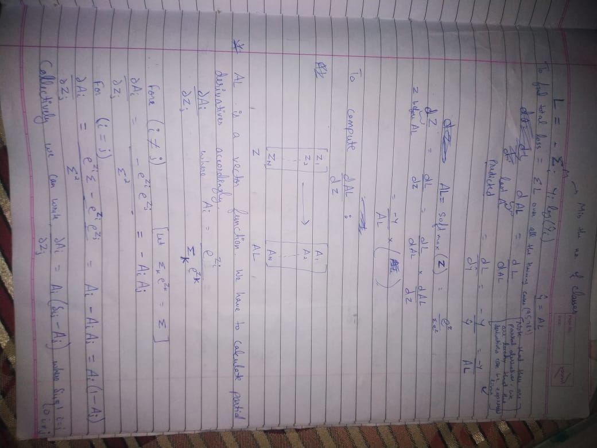

# Using numpy to create  neural network
Making the foundations strong by using numpy only to create a deep neural network to predict clothes size. The formulas for backpropagation are also calculated manually using Jacobian to find the partial derivates. 
Partial derivative of softmax function used in final layer :

